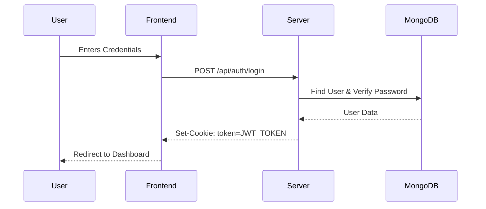

# 🚀 Job-Ready Pro: Advanced Authentication System


## 🌟 Overview

Welcome to the **Job-Ready Pro Authentication System**! This is a robust, production-grade backend built with the MERN stack (Node.js, Express, MongoDB) designed to provide a secure and scalable foundation for modern web applications.

This project implements industry-standard security practices, including JWT-based authentication, password hashing, and cookie-based session management.

---

## ✨ Features

- **🔐 Secure Authentication**: Full implementation of Login, Signup, and Logout.
- **🛡️ JWT & Cookies**: Secure token-based authentication with `httpOnly` cookies.
- **🔑 Password Hashing**: Utilizes `bcryptjs` for military-grade password encryption.
- **🚦 Middleware Protection**: Robust authorization layers to protect private routes.
- **📂 Scalable Architecture**: Clean and modular folder structure following MVC patterns.
- **🔌 Easy Integration**: Designed as a plug-and-play authentication engine for any frontend.

---

## 🛠️ Tech Stack

<div align="center">
  
  
  
  
  
</div>

---

## 📸 Visual Representation


*Conceptual UI of what can be built on top of this backend.*

---

## 📂 Project Structure

```bash
├── 📁 src
│   ├── 📁 config       # Database and environment configurations
│   ├── 📁 controllers  # Core business logic for auth
│   ├── 📁 middleware   # Auth guards and validation
│   ├── 📁 models       # MongoDB schemas (User model)
│   ├── 📁 routes       # API endpoint definitions
│   └── app.js         # Express app initialization
├── server.js          # Entry point (Server startup)
└── .env               # Environment variables
```

---

## 🚀 Getting Started

### 1. Prerequisites
- **Node.js** (v16 or higher)
- **MongoDB** (Atlas or local instance)

### 2. Installation

Clone the repository and install dependencies:

```bash
npm install
```

### 3. Environment Setup

Create a `.env` file in the root directory and add the following:

```env
PORT=5000
MONGODB_URI=your_mongodb_connection_string
JWT_SECRET=your_super_secret_key
```

### 4. Run the Application

```bash
# Development mode
npm run dev

# Production mode
npm start
```

---

## 🔌 API Endpoints

| Method | Endpoint | Description | Access |
| :--- | :--- | :--- | :--- |
| **POST** | `/api/auth/register` | Create a new user account | Public |
| **POST** | `/api/auth/login` | Authenticate user & get token | Public |
| **GET** | `/api/auth/logout` | Clear auth cookies | Public |
| **GET** | `/api/auth/get-me` | Get current user's profile | Private |

---

## 🏎️ Authentication Flow



---

## 🗺️ Interactive Roadmap

<details>
<summary><b>🚀 Phase 1: Core Authentication (Completed)</b></summary>

- [x] User Registration with Bcrypt
- [x] JWT Implementation
- [x] Cookie-based Session Management
- [x] Protected Routes Middleware
</details>

<details>
<summary><b>🎨 Phase 2: Enhanced Profile & UI (In Progress)</b></summary>

- [/] User Profile Picture Uploads
- [/] Email Verification System
- [/] Password Reset Functionality
</details>

<details>
<summary><b>⚡ Phase 3: Advanced Optimization (Planned)</b></summary>

- [ ] Rate Limiting
- [ ] Redis Caching for Sessions
- [ ] OAuth2 Integration (Google, GitHub)
</details>

---

## 🤝 Contributing

Contributions are what make the open source community such an amazing place to learn, inspire, and create. Any contributions you make are **greatly appreciated**.

1. Fork the Project
2. Create your Feature Branch (`git checkout -b feature/AmazingFeature`)
3. Commit your Changes (`git commit -m 'Add some AmazingFeature'`)
4. Push to the Branch (`git push origin feature/AmazingFeature`)
5. Open a Pull Request

---

<p align="center">
  Developed with ❤️ by Rahul
</p>
